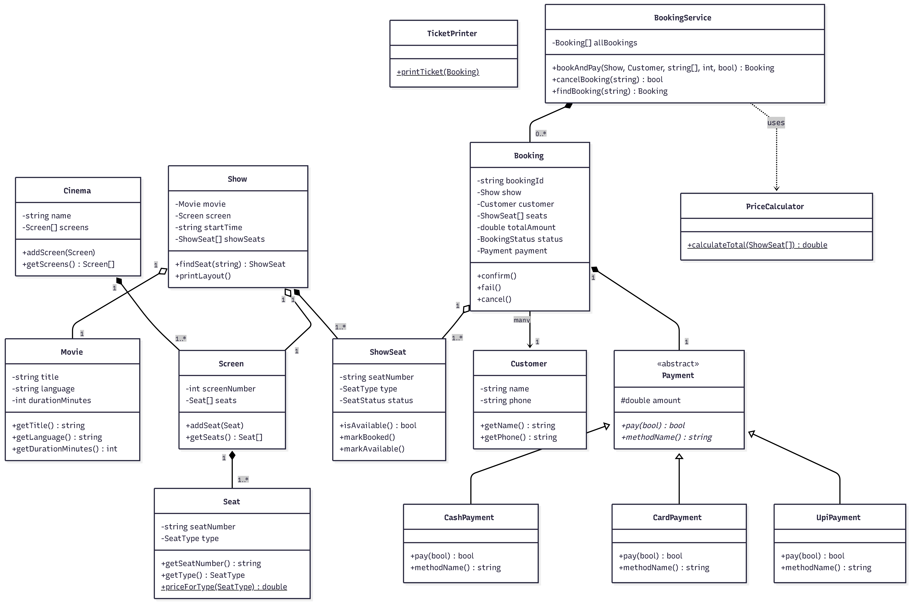
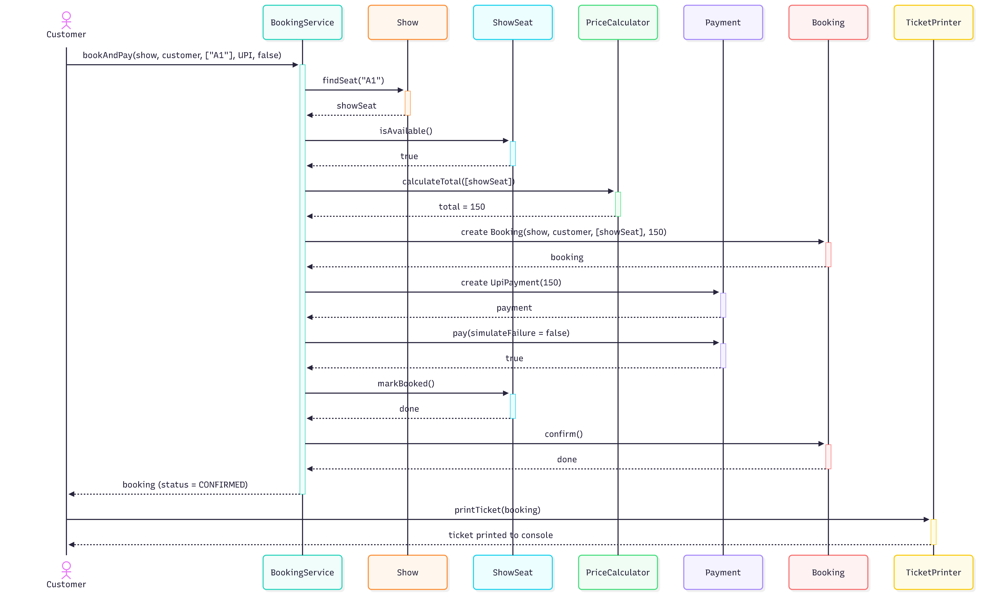

# 🎬 Movie Ticket Booking System (C++ Console App)

A menu-driven C++ console application that simulates single-cinema movie ticket booking — browsing shows, viewing live seat maps, booking with type-based pricing, paying by UPI/Card/Cash, printing tickets, and cancelling bookings.

Built as a System Design assignment, with a full OOP/UML design pass before a single line of code was written.

---

## ✨ Features

- 🎞️ List movies currently playing
- 🕒 Browse shows (screen + start time) per movie
- 💺 Live seat map — AVAILABLE / BOOKED, grouped by seat type
- 🎟️ Book one or more seats, priced by type: SILVER ₹150 · GOLD ₹250 · PLATINUM ₹400
- 💳 Pay by UPI / Card / Cash — a failed payment never confirms a booking
- 🧾 Print a full ticket: booking ID, movie, screen, time, seats, total
- ❌ Cancel a booking — seats return to AVAILABLE

## 🧱 Design

The system was modeled with a full requirement → noun-verb analysis → class design → relationship justification → UML pass before implementation. Highlights:

**Class Diagram**



**Sequence Diagram — "customer books 1 seat and pays by UPI"**



Full write-up (functional/non-functional requirements, noun-verb table, relationship justifications with the "lifetime test", and SOLID mapping) is in [`Assignment1_Analysis.md`](./Assignment1_Analysis.md).

## 🏗️ Architecture

One class per file, no header files — 13 classes plus a console-menu `main.cpp`:

```
Movie · Seat · Screen · Cinema · Show · ShowSeat · Customer · Booking
Payment (abstract) → UpiPayment · CardPayment · CashPayment
PriceCalculator · TicketPrinter · BookingService
```

**Key OOP/SOLID decisions:**
- `Payment` is an abstract base — adding a new payment method (e.g. NetBanking) only means adding one subclass, no changes to `BookingService`.
- `ShowSeat` (not `Seat`) holds booking status, because a seat's AVAILABLE/BOOKED state is scoped to one specific show, not the physical seat.
- `Booking` never formats its own ticket or checks seat availability — that's `TicketPrinter`'s and `BookingService`'s job respectively (Single Responsibility).

## 🚀 Getting Started

```bash
git clone https://github.com/<your-username>/movie-ticket-booking-cpp.git
cd movie-ticket-booking-cpp
g++ main.cpp -o ticketBooking
./ticketBooking
```

## 📸 Demo

```
===== MOVIE TICKET BOOKING =====
1. Movies  2. Book  3. Cancel  4. My tickets   0. Exit
Choose: 2
  [1] 3 Idiots  Hindi   170 min
  [2] Interstellar      English 169 min
Choose movie: 1
  [1] Screen-1  06:00 PM
Choose show: 1
  SCREEN-1  06:00 PM  |  3 Idiots
  SILVER   A1[ ] A2[ ] A3[ ] A4[ ]
  GOLD     B1[ ] B2[ ] B3[ ]
  PLATINUM C1[ ] C2[ ]
  ( [ ] = available   [X] = booked )
Seats (e.g. A1,B2): B2
...
  [UPI] Rs.250 paid successfully

  ================ TICKET ================
  Booking ID : BK1001
  Movie      : 3 Idiots
  Screen     : Screen-1   06:00 PM
  Seats      : B2
  Amount     : Rs.250      Status: CONFIRMED
  =========================================
```

**Edge cases handled:** booking an already-booked seat is rejected with nothing changed · a failed payment releases the seats and never confirms the booking · cancelling a confirmed booking frees its seats · invalid menu/seat/booking-id input never crashes the program.

## 🛠️ Tech

C++17 · zero external dependencies · pure STL (`<vector>`, `<string>`)

## 📄 License

MIT — feel free to fork and build on it.
