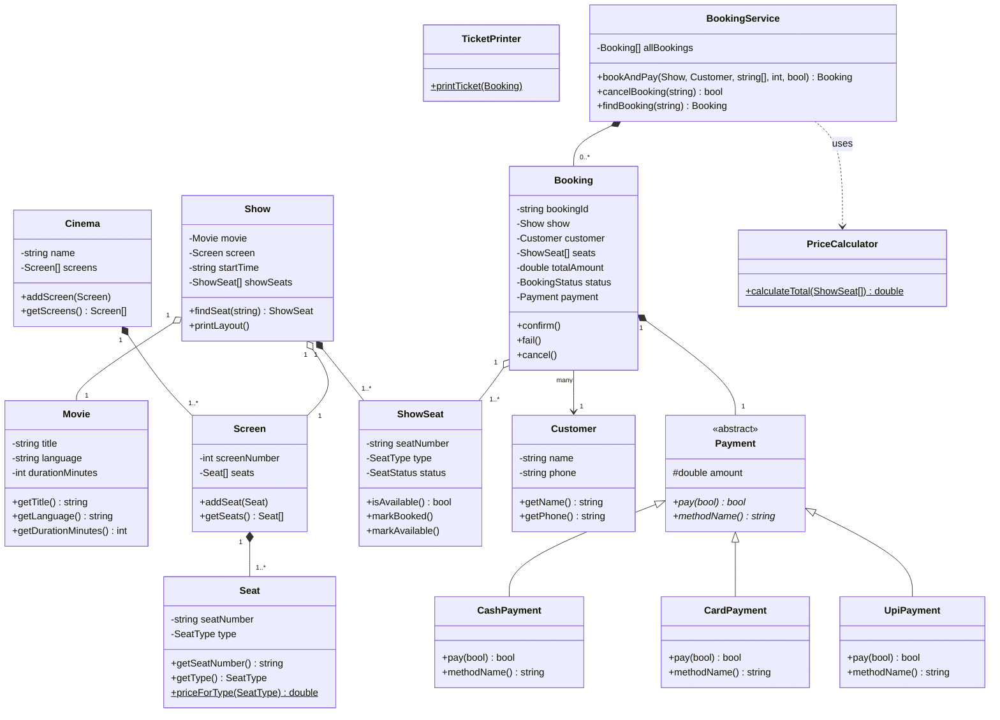
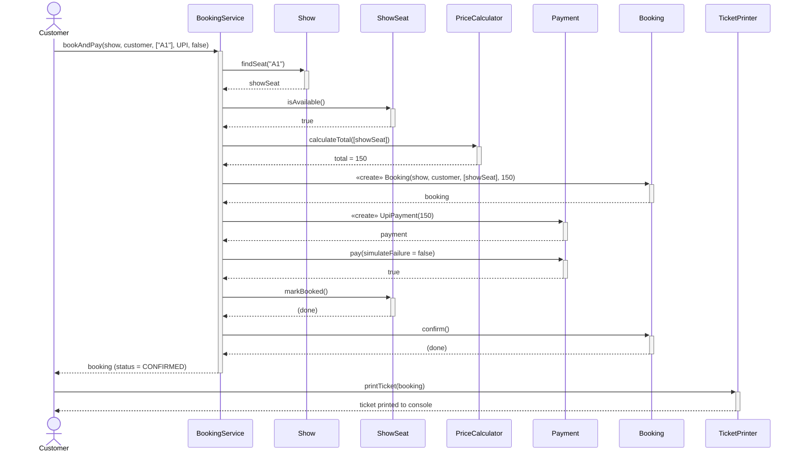

# Step E — Class Diagram & Step F — Sequence Diagram (Mermaid source)

Paste each block below into **https://mermaid.live** (or the Mermaid plugin for
draw.io / VS Code) to render, then export as PNG/SVG for your submission —
or redraw the same structure by hand on paper, which the assignment also allows.

---

## Step E — Class Diagram

**Notation key used above:** `*--` = composition (◆), `o--` = aggregation (◇),
`-->` = association, `<|--` = inheritance, `<<abstract>>` on `Payment` marks
the abstract base, `$` marks a static method, `#` marks protected.

---

## Step F — Sequence Diagram: "customer books 1 seat and pays by UPI"

